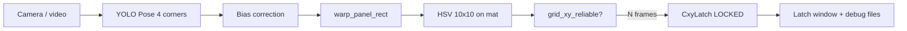

# Module B snapshot - live + CXY latch (2026-05-20)

Reference state for **YOLOv8-Pose → warp → HSV on mat → CXY latch** with live preview.

> **Purpose:** return to this doc and commands even as code evolves.  
> Verify: `./scripts/verify_module_b_snapshot.sh`

---

## What works (verified)

| Area | Status |
|------|--------|
| Panel corners (live) | YOLOv8-Pose + bias correction (`yolo_corner_bias.json`) |
| Grid / reprojection | `line_grid`, `grid_xy_reliable` (reproj ≤ 18 px, inliers ≥ 12) |
| CXY colours on warp | `live_card_detect` - inner trapezoid mask (6% inset) |
| False green from edge | Filtered on `Droniada_nag3` frames 3–4 (regression in `tests/`) |
| Ideal-frame latch | `CxyLatch` + `droniada_cxy_zatrzask` window + JPG/JSON/TXT save |

---

## Flow (live)



1. **Geometry:** `detect_corners_live(..., corner_mode='yolo_pose')` → TL/TR/BR/BL.  
2. **Warp:** panel rectangle, 10×10 grid in `analyze_panel_image` (`xy_mode=line_grid`).  
3. **Colours:** `detect_cards_live` - pixels mapping to **inner mat trapezoid** only.  
4. **Latch:** after `cxy_stable_frames` consecutive `reliable` frames - freeze best frame (min reproj).  
5. **Preview:** live window + separate latch window with `Row X, Col Y - COLOUR`.

---

## Commands - competition / recording

```bash
cd /path/to/Droniada/OGIEŃ
export DRONIADA_YOLO_POSE_WEIGHTS="$(pwd)/runs/pose/droniada_real_finetune/weights/best.pt"

.venv_yolo/bin/python -m release.run_live_panel \
  --video dataset/my_capture/Droniada_nag3.mov --rotate 180 \
  --corner-mode yolo_pose \
  --cxy-latch --cxy-stable-frames 5 \
  --max-reproj-reliable 18 --min-homography-inliers 12 \
  --xy-mode line_grid --angle-source rmat_linear \
  --cxy-latch-dir dataset/debug_cxy_latch
```

### Dashboard snapshots (`--bench` / `--dashboard`)

Saved when **geometry is good**, not only on `grid_xy_reliable` (RANSAC on warp often fails with 0 inliers while the grid looks fine on screen).

Conditions (`snapshot_frame_eligible` + `LiveSnapshotStore`):

- **3 grids** ≥ `--snapshot-min-grid-overlap` (default **0.88**; with `reliable=NO` and `inliers=0` → **0.92**);
- **reproj A** ≤ `--snapshot-max-reproj-a` (default **10 px**);
- **warp coverage** ≥ `--snapshot-min-warp-coverage` (default **0.6**);
- optional `--snapshot-require-reliable` (default off on nag5);
- reproj B ≤ `--snapshot-max-reproj`;
- `pnp_ok` (+ module A OK on `--bench`);
- `--snapshot-min-stable` consecutive frames;
- gallery replace when new reproj better by `--snapshot-replace-margin` px.

| Key | Action |
|-----|--------|
| `q` | Quit |
| `r` | Reset latch |
| `s` | Manual latch (when `reliable`) |

**After latch** in `dataset/debug_cxy_latch/`:

- `{frame}_latch.jpg` - dashboard  
- `{frame}_panel.jpg` - panel with labels  
- `{frame}_cxy.json` / `.txt` - coordinates and report  

---

## Regression test

```bash
.venv_yolo/bin/python -m unittest discover -s tests -p 'test_*.py' -v
```

Requires: `dataset/my_capture/Droniada_nag3.mov`, `runs/pose/droniada_real_finetune/weights/best.pt`.

---

## File map

| File | Role |
|------|------|
| `release/run_live_panel.py` | Live loop, integration, windows, latch save |
| `release/live_corners.py` | Corners (YOLO / CV), stabilisation |
| `release/yolo_pose_live.py` | YOLO-Pose inference + bias |
| `release/live_card_detect.py` | HSV on warp, mat mask, CXY |
| `release/cxy_latch.py` | Latch logic (N reliable frames) |
| `module_panel/analyze.py` | `analyze_panel_image`, `grid_xy_reliable` |
| `release/data/module_b_snapshot.json` | Machine manifest |

---

## Frozen parameters (manifest)

- YOLO: `runs/pose/droniada_real_finetune/weights/best.pt`  
- Bias: `module_panel/data/yolo_corner_bias.json`  
- Camera profile (recordings): `tarot_t10x_2a:wide`  
- Live rotation: `180`  
- `_PANEL_INSET_FRAC`: `0.06`  
- CXY latch: `5` stable frames, reproj reliable ≤ `18` px  

---

## Known limits

- Corner accuracy depends on finetune + bias; target &lt; 50 px median - in progress.  
- Very bright/dark cards may need HSV tuning.  
- Latch needs `grid_xy_reliable` on strict paths; use manual `s` when the frame looks good.

---

## vs historical CV baseline

Production path is **yolo_pose + cxy-latch**. Legacy CV modes (`corner_mode=roi_hybrid`, etc.) remain for diagnostics.
