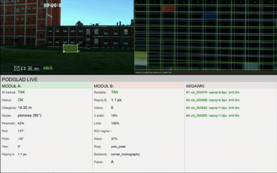

# Droniada Challenge 2026 — OGIEŃ vision pipeline

Vision stack for the **OGIEŃ** stage of [Droniada Challenge 2026](https://droniada.pl): live panel detection, YOLO-Pose corners, grid/colour reading (modules A & B), Jetson deployment, and a web dashboard for operators.

**Team:** SKN Robotycy × KINO

At the **Fire & Water** (*Ogień i Woda*) qualifier we were one of **two teams** that advanced to the OGIEŃ stage. We then **won the OGIEŃ competition** with this codebase — the same pipeline that runs locally on test footage and on the Jetson in the field.

**Results:** [Droniada 2026 — wyniki i nagrody (PDF)](docs/assets/Droniada-2026-wyniki-nagrody.pdf)

## Demo

Live dashboard (`:8088`), YOLO-Pose corners, module B grid + card colours (screen capture, June 2026):



Source recording (local, gitignored): `OGIEŃ/docs/demo.mov`.  
Regenerate GIF: `./scripts/make_readme_demo.sh OGIEŃ/docs/demo.mov`

## Repository layout

- **`OGIEŃ/`** — main vision project (YOLO-Pose, modules A/B, snapshots, web dashboard, autonomy integration).  
  Details: [`OGIEŃ/README.md`](OGIEŃ/README.md) and [`OGIEŃ/docs/`](OGIEŃ/docs/).
- **`OGIEŃ/Droniada_utils/`** — small Tkinter GUI for gimbal control over WebSocket (`gui.py`).

Training images, competition videos, YOLO weights, and live session dumps are **gitignored** — the repo is the code and docs, not the data bundle.

## Quick start — vision (`OGIEŃ/`)

```bash
cd OGIEŃ
python3 -m venv .venv
source .venv/bin/activate
pip install -r requirements.txt
```

Train or copy YOLO weights to `runs/pose/droniada_real_finetune/weights/best.pt` (see [`OGIEŃ/README.md`](OGIEŃ/README.md) — Blender export + two-stage training). For a quick live test, point at any panel recording:

```bash
./scripts/run_local_video_test.sh /path/to/your_panel.mov
# dashboard: http://127.0.0.1:8088/   operator: http://127.0.0.1:8089/
```

Further reading:

- [`OGIEŃ/README.md`](OGIEŃ/README.md) — modules A/B, dataset layout, CLI modes  
- [`OGIEŃ/docs/INTEGRATION.md`](OGIEŃ/docs/INTEGRATION.md) — WebSocket + GStreamer integration  
- [`OGIEŃ/docs/JETSON_DOCKER.md`](OGIEŃ/docs/JETSON_DOCKER.md) — Jetson Docker runtime  
- [`OGIEŃ/docs/COMPETITION_REPORT.md`](OGIEŃ/docs/COMPETITION_REPORT.md) — competition report line format  

## Quick start — gimbal GUI (`OGIEŃ/Droniada_utils/`)

```bash
cd OGIEŃ/Droniada_utils
python3 -m venv .venv
source .venv/bin/activate
pip install -r requirements.txt
python gui.py
```

Default WebSocket target: `ws://192.168.100.200:6100` (edit in `gui.py`).

## License

GPL-3.0-or-later — see [`LICENSE`](LICENSE).
