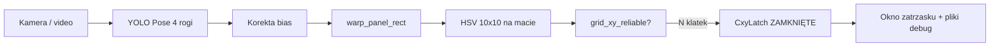

# Migawka modułu B — live + CXY latch (2026-05-20)

Stan referencyjny po ustaleniu ścieżki **YOLOv8-Pose → warp → HSV na macie → zatrzask CXY** z podglądem w oknie.

> **Cel migawki:** można wrócić do tego opisu i komend, nawet gdy kod dalej się zmieni.  
> Weryfikacja: `./scripts/verify_module_b_snapshot.sh`

---

## Co działa (potwierdzone)

| Obszar | Status |
|--------|--------|
| Rogi panelu (live) | YOLOv8-Pose + korekta bias (`yolo_corner_bias.json`) |
| Siatka / reprojekcja | `line_grid`, `grid_xy_reliable` (reproj ≤ 18 px, inliers ≥ 12) |
| Kolory CXY na warpie | `live_card_detect` — maska wewnętrznego trapezu (6% inset), bez pomijania wiersza 1 / bez „antytrawy” |
| Fałszywa zieleń z brzegu | Odfiltrowana na `Droniada_nag3` klatki 3–4 (regresja w `tests/`) |
| Zatrzask idealnej klatki | `CxyLatch` + okno `droniada_cxy_zatrzask` + zapis JPG/JSON/TXT |

---

## Przepływ (live)



1. **Geometria:** `detect_corners_live(..., corner_mode='yolo_pose')` → 4 rogi TL/TR/BR/BL.  
2. **Warp:** prostokąt panelu, siatka 10×10 w `analyze_panel_image` (`xy_mode=line_grid`).  
3. **Kolory:** `detect_cards_live` — tylko pikseli mapujących się do **wewnętrznego trapezu** maty (nie trawa spoza panelu w rogach siatki).  
4. **Zatrzask:** po `cxy_stable_frames` kolejnych klatek `reliable` — zamrożenie najlepszej klatki (min. reproj).  
5. **Podgląd:** okno live + osobne okno zatrzasku z listą `Wiersz X, Kolumna Y — KOLOR`.

---

## Komendy — produkcja na zawody / nagranie

```bash
cd /ścieżka/do/Droniada
export DRONIADA_YOLO_POSE_WEIGHTS="$(pwd)/runs/pose/droniada_real_finetune/weights/best.pt"

# Live + zatrzask (okna włączą się automatycznie przy --cxy-latch)
.venv_yolo/bin/python -m release.run_live_panel \
  --video dataset/my_capture/Droniada_nag3.mov --rotate 180 \
  --corner-mode yolo_pose \
  --cxy-latch --cxy-stable-frames 5 \
  --max-reproj-reliable 18 --min-homography-inliers 12 \
  --xy-mode line_grid --angle-source rmat_linear \
  --cxy-latch-dir dataset/debug_cxy_latch
```

### Migawki w dashboardzie (`--bench` / `--dashboard`)

Zapis gdy **geometria jest dobra**, nie tylko przy `grid_xy_reliable` (RANSAC linii na warpie często pada przy 0 inlierach, mimo że siatka na kadrze wygląda idealnie).

Warunki (`snapshot_frame_eligible` + `LiveSnapshotStore`):

- **3 siatki** ≥ `--snapshot-min-grid-overlap` (dom. **0.88**; przy `reliable=NIE` i `inliers=0` → **0.92**);
- **reproj A** ≤ `--snapshot-max-reproj-a` (dom. **10 px**);
- **pokrycie warpu** ≥ `--snapshot-min-warp-coverage` (dom. **0.6**) — kolumny brzegowe jak środek (bez tła z boku);
- opcjonalnie `--snapshot-require-reliable` (dom. wyłączone na nag5);
- reproj B ≤ `--snapshot-max-reproj`;
- `pnp_ok` (+ Moduł A OK na `--bench`);
- `--snapshot-min-stable` klatek z rzędu (na `--bench` domyślnie **1**; przy pokryciu ≥ 98% wystarczy **1** klatka);
- pełna galeria: zamiana gdy nowa reproj o `--snapshot-replace-margin` px lepsza.

| Klawisz | Akcja |
|---------|--------|
| `q` | Wyjście |
| `r` | Reset zatrzasku |
| `s` | Ręczne zatrzaśnięcie (gdy `reliable`) |

**Po zatrzaśnięciu** w `dataset/debug_cxy_latch/`:

- `{klatka}_latch.jpg` — dashboard (kamera + panel + lista CXY)  
- `{klatka}_panel.jpg` — sam panel z etykietami  
- `{klatka}_cxy.json` / `.txt` — współrzędne i raport  

---

## Test regresji (migawka)

```bash
.venv_yolo/bin/python -m unittest discover -s tests -p 'test_*.py' -v
```

- `tests/test_live_card_detect_nag3.py` — klatki 3–4 `nag3`: tylko **W8 K7 POMARANCZOWA**  
- `tests/test_cxy_latch_preview.py` — mapowanie wierszy (1 = dół warpu)

Wymaga: `dataset/my_capture/Droniada_nag3.mov`, `runs/pose/droniada_real_finetune/weights/best.pt`.

---

## Pliki — mapa odpowiedzialności

| Plik | Rola |
|------|------|
| `release/run_live_panel.py` | Pętla live, integracja, okna, zapis latch |
| `release/live_corners.py` | Detekcja rogów (YOLO / CV), stabilizacja |
| `release/yolo_pose_live.py` | Inferencja YOLO-Pose + bias |
| `release/yolo_corner_bias.py` | Kalibracja / stosowanie korekty rogów |
| `release/live_card_detect.py` | HSV na warpie, maska maty, CXY |
| `release/panel_black.py` | Progi czerni panelu (kalibracja z rogów) |
| `release/cxy_latch.py` | Logika zatrzasku (N klatek reliable) |
| `release/cxy_latch_preview.py` | Rysowanie panelu + zapis artefaktów |
| `module_panel/analyze.py` | `analyze_panel_image`, `grid_xy_reliable` |
| `module_geom/line_grid.py` | Siatka `line_grid` v3 |
| `tests/test_live_card_detect_nag3.py` | Regresja kolorów |
| `release/data/module_b_snapshot.json` | Manifest maszynowy tej migawki |

---

## Parametry (zamrożone w manifeście)

- YOLO: `runs/pose/droniada_real_finetune/weights/best.pt`  
- Bias: `module_panel/data/yolo_corner_bias.json` (`DRONIADA_YOLO_BIAS=1` domyślnie w live)  
- Profil kamery (nagrania): `tarot_t10x_2a:wide`  
- Obrót live: `180` (nagrania z gimbala)  
- `_PANEL_INSET_FRAC`: `0.06` — wewnętrzny trapez maty  
- `_MIN_VALID_CELL_FRAC`: `0.50` — min. pikseli komórki na macie  
- CXY latch: `5` klatek stable, reproj reliable ≤ `18` px  

---

## Znane ograniczenia (świadome)

- Dokładność rogów zależy od finetune + bias; cel &lt; 50 px median — w toku (więcej etykiet real).  
- Bardzo jasne / ciemne kartki mogą wymagać strojenia HSV.  
- `mask_keep_inside_panel` nie rozróżnia trawy wewnątrz luźnego trapezu YOLO — dlatego używamy **inset + maski warpu**, nie pomijania wiersza 1.  
- Zatrzask wymaga `grid_xy_reliable`; przy złym ujęciu użyj `s` ręcznie gdy ramka jest OK.

---

## Historia względem `BASELINE.md`

| `BASELINE.md` (2026-05-21) | Ta migawka |
|----------------------------|------------|
| `align_hybrid` + żółty trapez | **YOLO-Pose** jako tryb produkcyjny |
| CXY „w toku” | CXY + latch + okno + test regresji |
| Brak zatrzasku | `CxyLatch` + `cxy_latch_preview` |

Stary baseline CV nadal w kodzie (`corner_mode=roi_hybrid` itd.) — migawka dotyczy ścieżki **yolo_pose + cxy-latch**.

---

## Przywracanie „z migawki”

1. Uruchom `./scripts/verify_module_b_snapshot.sh` — testy muszą przejść.  
2. Użyj komend z sekcji „Komendy” z tym samym `best.pt` i bias JSON.  
3. Porównaj nowy `{klatka}_latch.jpg` z zapisem w `dataset/debug_cxy_latch/` z dnia migawki.
